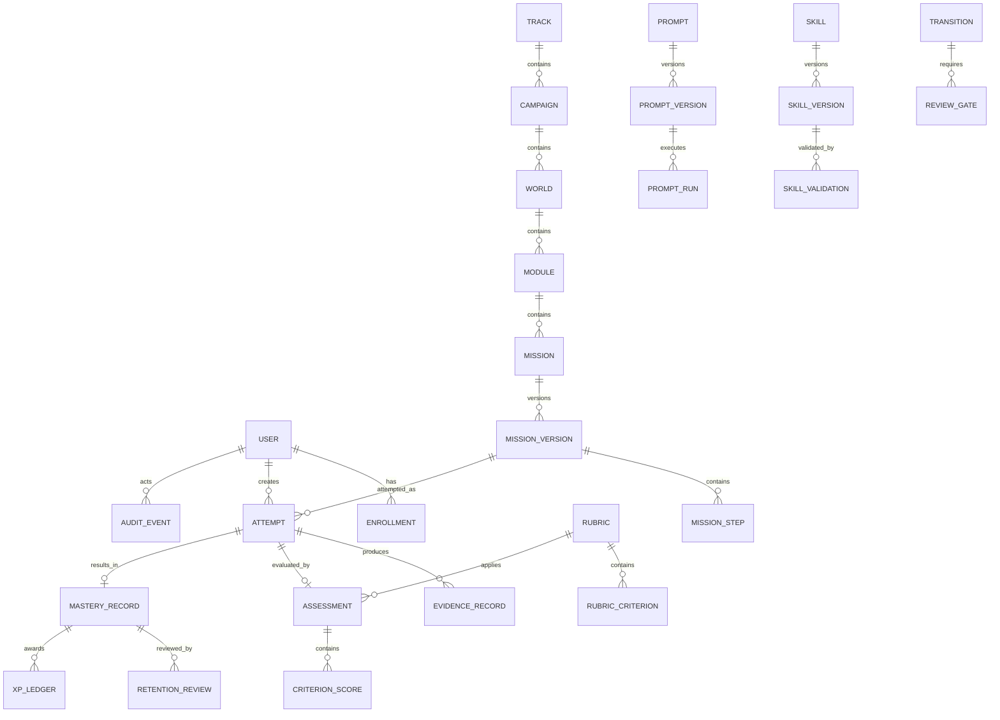

# Modelo de relacionamento

```mermaid
erDiagram
  USER ||--o{ ENROLLMENT : has
  USER ||--o{ ATTEMPT : creates
  TRACK ||--o{ CAMPAIGN : contains
  CAMPAIGN ||--o{ WORLD : contains
  WORLD ||--o{ MODULE : contains
  MODULE ||--o{ MISSION : contains
  MISSION ||--o{ MISSION_VERSION : versions
  MISSION_VERSION ||--o{ MISSION_STEP : contains
  MISSION_VERSION ||--o{ ATTEMPT : attempted_as
  ATTEMPT ||--o{ EVIDENCE_RECORD : produces
  ATTEMPT ||--o| ASSESSMENT : evaluated_by
  RUBRIC ||--o{ RUBRIC_CRITERION : contains
  RUBRIC ||--o{ ASSESSMENT : applies
  ASSESSMENT ||--o{ CRITERION_SCORE : contains
  ATTEMPT ||--o| MASTERY_RECORD : results_in
  MASTERY_RECORD ||--o{ RETENTION_REVIEW : reviewed_by
  MASTERY_RECORD ||--o{ XP_LEDGER : awards
  PROMPT ||--o{ PROMPT_VERSION : versions
  PROMPT_VERSION ||--o{ PROMPT_RUN : executes
  SKILL ||--o{ SKILL_VERSION : versions
  SKILL_VERSION ||--o{ SKILL_VALIDATION : validated_by
  TRANSITION ||--o{ REVIEW_GATE : requires
  USER ||--o{ AUDIT_EVENT : acts
```

Relações curriculares usam posição separada do ID. Tentativas ficam permanentemente ligadas às versões utilizadas.
